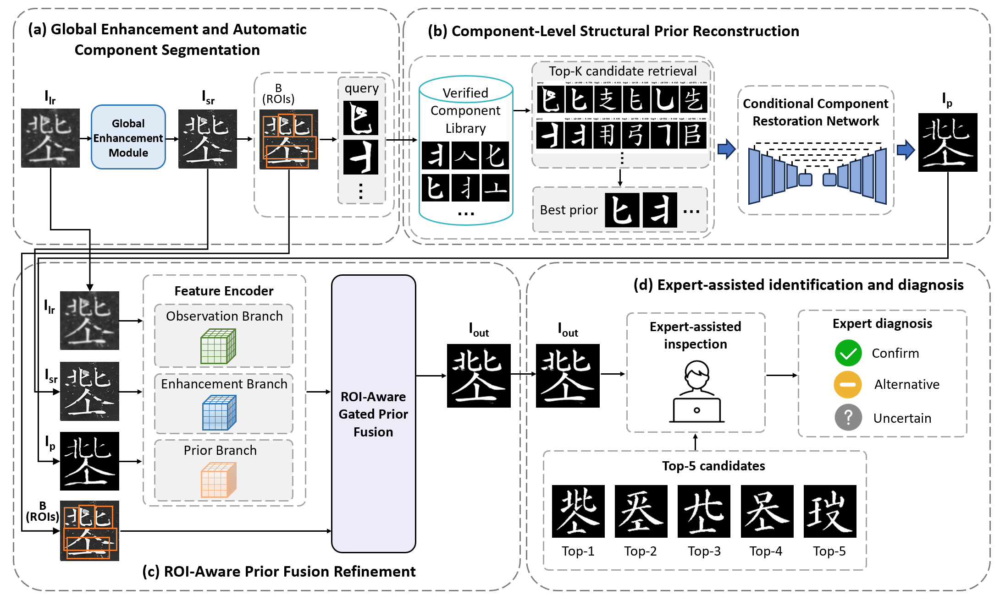

# Khitan Character Image Restoration

Official PyTorch implementation of **Digital Restoration of Khitan Large Script Inscriptions: A Cultural Heritage Perspective**.

> Authors: TODO: add author names  
> Affiliation: TODO: add affiliation  
> Paper / Preprint: TODO: add paper link  
> Project page: TODO: add project page link

[[`Paper`](TODO)] [[`Dataset`](TODO)] [[`Weights`](TODO)] [[`Results`](docs/results/README.md)]

---



We propose a restoration pipeline for blurry Khitan character/text images. The method first enhances low-quality inputs using SwinIR, segments character components, retrieves component-level structural priors, reconstructs candidate glyphs with a Stage1 codebook + StyleGAN model, and finally refines the image with prior-guided fusion.

## News

- [ ] Public dataset link will be released.
- [ ] Trained model weights will be released.
- [ ] Qualitative restoration examples will be added under `docs/results/`.

## Installation

Python 3.10+ is recommended.

```bash
git clone https://github.com/<YOUR_NAME>/<YOUR_REPO>.git
cd <YOUR_REPO>
python -m venv .venv
source .venv/bin/activate  # Windows: .venv\Scripts\activate
pip install -r requirements.txt
pip install -e .
```

If the default PyTorch wheel does not match your CUDA version, install PyTorch from the official PyTorch selector first, then run the remaining commands.

## Dataset

Please organize the dataset as follows:

```text
dataset/
  components/
    mask/
    soft/
    component_annotations.json
    component_vocab.json
  data/
    train/
      trainL/
      trainH/
    test/
      testL/
      testH/
```

|         Dataset          | Description                                                  | Link |
| :----------------------: | :----------------------------------------------------------- | :--: |
| Khitan paired LR/HR data | Paired low-resolution and high-resolution images for learned refinement. | TODO |
|     Khitan test set      | Low-quality test images and optional ground truth.           | TODO |

If annotation files are not included, build them with:

```bash
python scripts/build_component_annotations.py --components-root dataset/components
```

## Trained Models

Large checkpoint files are not stored in this repository. Download them from the links below and place them in the target paths.

|       Model        | Usage                                              | Target Path                                                  |    Weights    |
| :----------------: | :------------------------------------------------- | :----------------------------------------------------------- | :-----------: |
| SwinIR real-SR x4  | Super-resolution backbone                          | `model_zoo/swinir/003_realSR_BSRGAN_DFO_s64w8_SwinIR-M_x4_GAN.pth` | Auto-download |
|     Stage1 GAN     | Component retrieval and structure prior generation | `checkpoints/stage1_best.pth`                                |     TODO      |
| Instance restorer  | Conditional component restoration                  | `checkpoints/instance_restoration_best.pth`                  |     TODO      |
| Learned refinement | ROI-based SR/prior fusion                          | `checkpoints/learned_refinement_best.pth`                    |     TODO      |

## Training Tutorial

- [x] Generate SwinIR outputs for the training LR images
- [x] Segment the super-resolved training images
- [x] Generate component-level restoration priors
- [x] Train the learned ROI-based refinement network

The learned refinement model is trained after three preprocessing stages. These stages create the `retrieval_results_all.json` file used by `configs/refinement_learned.data1.yaml`.

### Step 1: Super-Resolve Training Images

```bash
python -m khitan_restore.cli super-resolve \
  --config configs/pipeline.server.sy.yaml \
  --input /home/sy/dataset/data1/data/train1/trainL \
  --output runs/data2_train/01_super_resolution
```

Input:

- `/home/sy/dataset/data1/data/train1/trainL`: low-resolution training images.

Output:

- `runs/data2_train/01_super_resolution/images`: SwinIR super-resolved images.
- `runs/data2_train/01_super_resolution/manifest.json`: super-resolution stage metadata.

### Step 2: Segment Super-Resolved Images

```bash
python -m khitan_restore.cli segment \
  --config configs/pipeline.server.sy.yaml \
  --input runs/data2_train/01_super_resolution/images \
  --output runs/data2_train/02_segmentation
```

Input:

- `runs/data2_train/01_super_resolution/images`: output images from Step 1.

Output:

- `runs/data2_train/02_segmentation/segment_results.json`: component boxes and segmentation results.
- `runs/data2_train/02_segmentation/patches`: segmented component patches.
- `runs/data2_train/02_segmentation/visualizations`: segmentation visualization files.

### Step 3: Generate Component Restoration Priors

```bash
python -m khitan_restore.cli restore-components \
  --config configs/pipeline.server.sy.yaml \
  --segment-json runs/data2_train/02_segmentation/segment_results.json \
  --output runs/data2_train/03_restoration
```

Input:

- `runs/data2_train/02_segmentation/segment_results.json`: output JSON from Step 2.
- The component restoration checkpoint configured in `configs/pipeline.server.sy.yaml`.

Output:

- `runs/data2_train/03_restoration/retrieval_results_all.json`: retrieval and generated-prior metadata.
- `runs/data2_train/03_restoration/<image_name>/reconstructed_rank1.png`: generated structure prior for each image.
- `runs/data2_train/03_restoration/prototype_bank_preview.png`: optional component bank preview.

This command is usually slower, so `nohup ... &` is used to keep it running after disconnecting from the server.

### Step 4: Train Learned Refinement

```bash
python -m khitan_restore.cli train-learned-refinement \
  --config configs/refinement_learned.data1.yaml
```

`configs/refinement_learned.data1.yaml` expects:

- `data.restoration_results_path`: `/home/sy/item/swin/runs/data2_train/03_restoration/retrieval_results_all.json`
- `data.lr_dir`: `/home/sy/dataset/data1/data/train1/trainL`
- `data.gt_dir`: `/home/sy/dataset/data1/data/train1/trainH`

The training output is written to:

- `runs/learned_refinement_data2/checkpoints/learned_refinement_best.pth`
- `runs/learned_refinement_data2/checkpoints/learned_refinement_last.pth`
- `runs/learned_refinement_data2/previews`
- `runs/learned_refinement_data2/metrics_history.json`

All training commands support checkpoint resume with `--resume <checkpoint.pth>`.

## Testing

Run the full restoration pipeline:

```bash
python -m khitan_restore.cli pipeline \
  --config configs/pipeline.example.yaml \
  --input dataset/data/test/testL \
  --output runs/test_pipeline
```

## Results

### Quantitative Results

#### Light Degradation

|   Method    |   PSNR    |   SSIM   |  LPIPS   |    F1    |
| :---------: | :-------: | :------: | :------: | :------: |
|   Uformer   |   26.14   |   .957   |   .027   |   .968   |
|   RubGAN    |   23.79   |   .943   |   .058   |   .965   |
|   DocDiff   |   22.00   |   .909   |   .072   |   .953   |
|    GSDM     |   14.66   |   .674   |   .457   |   .802   |
|   DiffACR   |   27.73   |   .970   | **.015** |   .972   |
|   DocRes    |   14.30   |   .823   |   .259   |   .754   |
|  MFE-GAN-U  |   9.86    |   .702   |   .364   |   .703   |
| MFE-GAN-U++ |   12.66   |   .797   |   .301   |   .810   |
|  DocUnfold  |   25.05   |   .947   |   .028   |   .965   |
|  **Ours**   | **29.98** | **.984** | **.015** | **.985** |

#### Medium Degradation

|   Method    |   PSNR    |   SSIM   |  LPIPS   |    F1    |
| :---------: | :-------: | :------: | :------: | :------: |
|   Uformer   |   24.59   |   .941   |   .035   |   .962   |
|   RubGAN    |   22.99   |   .930   |   .063   |   .959   |
|   DocDiff   |   20.83   |   .884   |   .087   |   .941   |
|    GSDM     |   15.36   |   .733   |   .421   |   .819   |
|   DiffACR   |   26.51   |   .963   |   .019   |   .941   |
|   DocRes    |   13.01   |   .793   |   .311   |   .670   |
|  MFE-GAN-U  |   9.85    |   .686   |   .364   |   .702   |
| MFE-GAN-U++ |   12.70   |   .785   |   .298   |   .811   |
|  DocUnfold  |   23.84   |   .932   |   .034   |   .959   |
|  **Ours**   | **28.78** | **.981** | **.018** | **.982** |

#### Severe Degradation

|   Method    |   PSNR    |   SSIM   |  LPIPS   |    F1    |
| :---------: | :-------: | :------: | :------: | :------: |
|   Uformer   |   19.80   |   .806   |   .104   |   .894   |
|   RubGAN    |   17.83   |   .704   |   .163   |   .805   |
|   DocDiff   |   16.87   |   .687   |   .201   |   .819   |
|    GSDM     |   13.96   |   .707   |   .466   |   .682   |
|   DiffACR   |   20.26   |   .813   | **.097** |   .882   |
|   DocRes    |   11.15   |   .732   |   .470   |   .419   |
|  MFE-GAN-U  |   9.29    |   .656   |   .383   |   .668   |
| MFE-GAN-U++ |   11.39   |   .736   |   .332   |   .752   |
|  DocUnfold  |   19.54   |   .797   | **.097** |   .889   |
|  **Ours**   | **22.54** | **.883** |   .098   | **.919** |

### Qualitative Results


Add result images to `docs/results/` before publishing. Recommended files:

- `framework.png`
- `comparison.png`

## Evaluation

Evaluation can be performed as follows:

```bash
python -m khitan_restore.evaluate_refinement \
  --input runs/test_pipeline/04_refinement \
  --gt-dir dataset/data/test/testH \
  --output runs/test_pipeline/evaluation.json \
  --device auto
```

The evaluator reports PSNR, SSIM, LPIPS, STSC, IoU, precision, recall, F1, and Dice when ground-truth images are available.

## Acknowledgement

This repository uses and adapts code or ideas from the following projects:

- [SwinIR](https://github.com/JingyunLiang/SwinIR)
- [timm](https://github.com/huggingface/pytorch-image-models)
- PyTorch, TorchVision, TorchMetrics, OpenCV, and scikit-image

## License

This project is released under the Apache-2.0 License. Please see [LICENSE](LICENSE) for more information.

## Citation

If you find this repository helpful, please consider citing:

```bibtex
@misc{khitan_restoration_2026,
  title={Khitan Character Image Restoration with SwinIR, Component Retrieval, and Prior-Guided Refinement},
  author={TODO},
  year={2026},
  howpublished={\url{https://github.com/<YOUR_NAME>/<YOUR_REPO>}}
}
```
